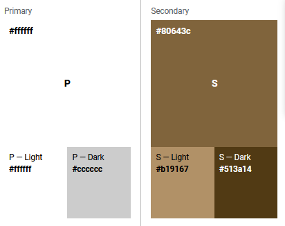

# <u>Mars News App</u>

Sehe dir die Seite auf [Heroku](https://mars-news-app.herokuapp.com) an. :)

## <u>Inhaltsverzeichnis</u>

1. [Service](#service)
2. [Installationsschritte](#installationsschritte)
3. [Google's Material Design Color System](#googles-material-design-color-system)


## <u>Service</u>

Die Mars News App informiert einen über das vergangene und aktuelle Wetter auf dem Mars und liefert interessante Mars Rover Bilder. Da nicht jeden Tag eine bahnbrechende Entdeckung gemacht wird und man sonst nur die Bilder in den Medien mitbekommt, soll diese App Ihnen die Möglichkeit geben die neusten Bilder/Wetter direkt ohne großen Auffand sehen zu können, damit Sie selbst immer auf dem neusten Stand bleiben. Dabei werden zwei NASA APIs verwendet, zum einen die Mars Rover Photos API [`https://api.nasa.gov/mars-photos/api`](https://api.nasa.gov/mars-photos/api/v1/rovers/curiosity/photos?earth_date=2015-6-3&api_key=DEMO_KEY) und zum anderen die InSight / Wetter API [`https://api.nasa.gov/insight_weather`](https://api.nasa.gov/insight_weather/?api_key=DEMO_KEY&feedtype=json&ver=1.0). Beide APIs werden von der NASA kostenfrei zur Verfügung gestellt, man benötigt einzig und allein einen API Zugangs Schlüssel.


## <u>Installationsschritte</u>

1. Öffne die Konsole und gehe in dein Zielverzeichnis 

2. Dann in der Konsole folgendes eingeben:

   ```
   $ git clone https://git.thm.de/mgod03/mars-news-app.git
   $ cd mars-news-app
   $ npm install
   $ set DEBUG=myapp:* & npm start
   ```

3. Nun kannst du die Website unter [http://localhost:3000/](http://localhost:3000/) abrufen.


## <u>Google's Material Design Color System</u>




